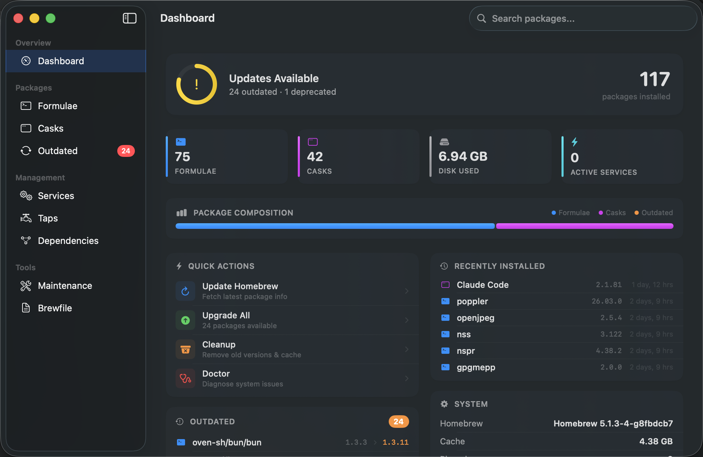
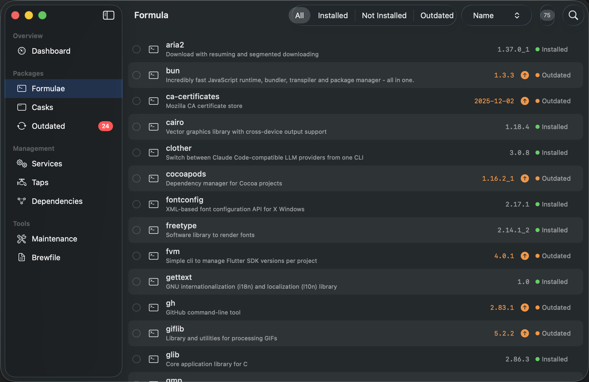
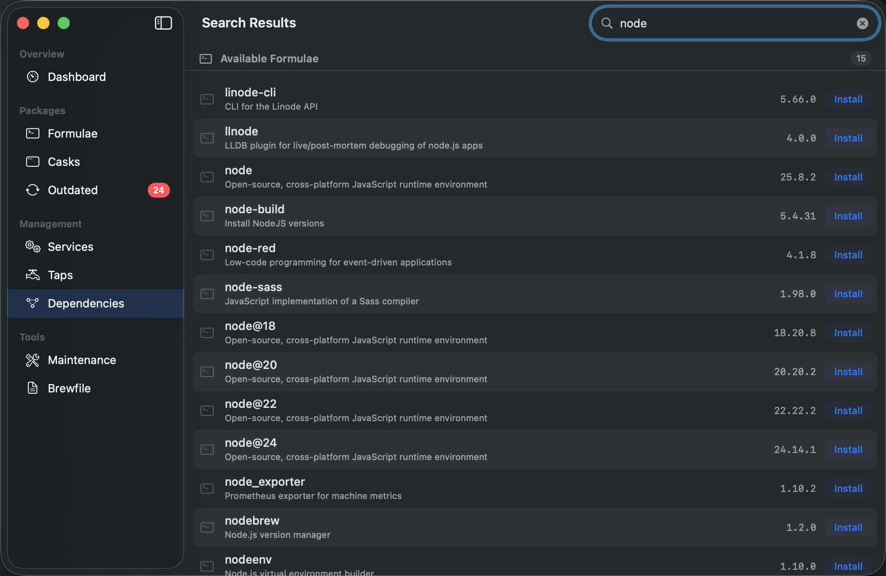
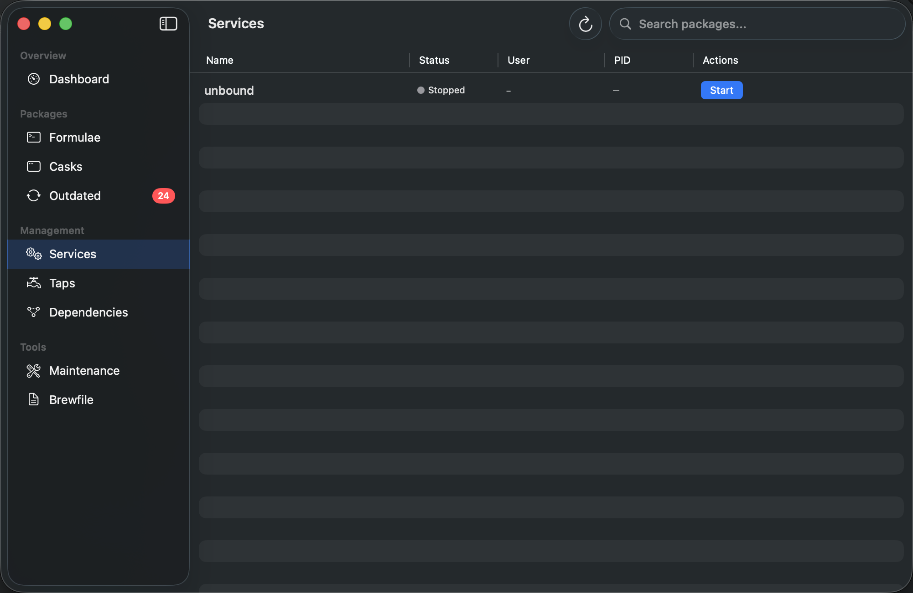
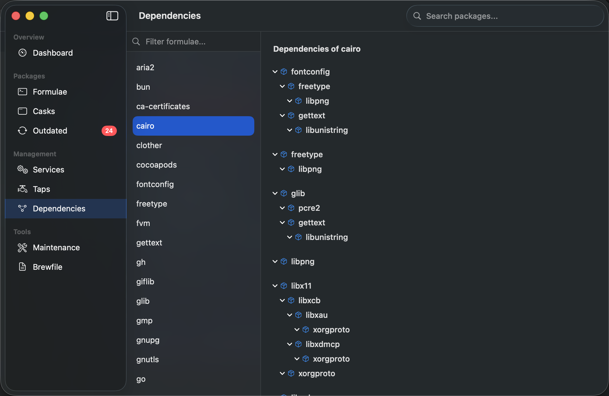

# BrewDesk

A native macOS GUI for [Homebrew](https://brew.sh) -- manage packages, casks, taps, services, and more without touching the terminal.








## Install

### One-liner (installs Homebrew + BrewDesk)

If you don't have Homebrew installed yet, this single command installs both Homebrew and BrewDesk:

```bash
/bin/bash -c "$(curl -fsSL https://raw.githubusercontent.com/Homebrew/install/HEAD/install.sh)" && brew tap aljaff94/brewdesk https://github.com/aljaff94/BrewDesk.git && brew install --cask brewdesk
```

### Homebrew (if you already have Homebrew)

```bash
brew tap aljaff94/brewdesk https://github.com/aljaff94/BrewDesk.git
brew install --cask brewdesk
```

### Download

Grab the latest `.dmg` or `.zip` from [Releases](https://github.com/aljaff94/BrewDesk/releases/latest).

### Build from source

```bash
git clone https://github.com/aljaff94/BrewDesk.git
cd BrewDesk
brew install xcodegen
xcodegen generate
open BrewDesk.xcodeproj
```

## Features

### Dashboard
- System health ring with outdated/deprecated status at a glance
- Package composition bar showing formulae vs casks ratio
- Stats: installed count, disk usage, active services
- Outdated packages list with version diffs (e.g. `1.2.3` -> `1.3.0`)
- Recently installed packages with timestamps
- Quick actions: Update, Upgrade All, Cleanup, Doctor
- Operation history

### Package Management
- Browse, search, install, upgrade, and uninstall formulae and casks
- Unified search: shows installed formulae, installed casks, available formulae, and available casks grouped in one view
- Version picker for formulae with multiple versions (e.g. `node@20`, `node@22`)
- Bulk select and upgrade/uninstall multiple packages at once
- Inline upgrade button for outdated packages
- Sort by name, type, status, or install date

### Services
- Start, stop, and restart Homebrew services (PostgreSQL, Redis, etc.)
- View status, user, and PID at a glance

### Taps
- Instant tap listing (loads in ~50ms)
- View installed taps with formula/cask counts
- Add and remove third-party taps

### Dependencies
- Interactive dependency tree for any installed formula
- Reverse dependency lookup -- see what depends on a package before removing it

### Maintenance
- Run `brew doctor` and view warnings
- Preview and run cleanup to free disk space
- Cache size monitoring

### Brewfile
- Export your setup as a Brewfile, JSON, or plain text
- Import a Brewfile to reproduce your setup on another machine
- Drag & drop Brewfile import

### More
- Data caching for instant tab switching -- no re-fetching when navigating
- Global search bar with grouped results
- Disk usage per package in detail view
- Install date tracking
- Open installed cask apps directly from the list
- Operation history with full terminal output
- Cancel running operations
- Menu bar extra with outdated package count
- Auto-update on launch and periodic update checks
- macOS notifications for new updates
- Skeleton loading states with shimmer

## Keyboard Shortcuts

| Shortcut | Action |
|---|---|
| `Cmd+F` | Focus search |
| `Cmd+Shift+H` | Operation history |
| `Delete` | Uninstall selected packages |

## Requirements

- macOS 14.0 (Sonoma) or later
- [Homebrew](https://brew.sh) installed

## Uninstall

```bash
brew uninstall --cask brewdesk
brew untap aljaff94/brewdesk
```

## License

MIT
